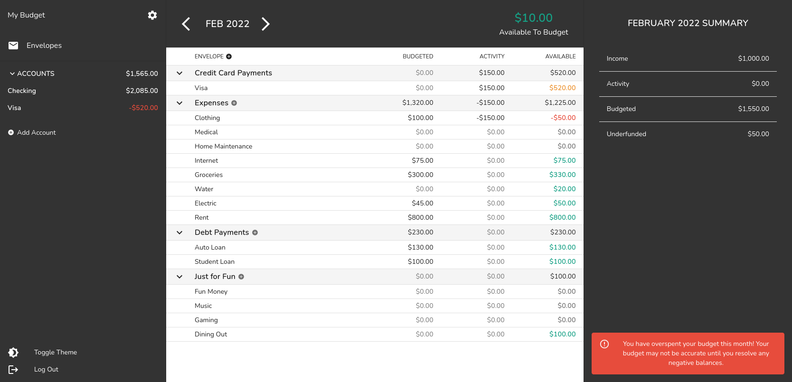

# BudgE
BudgE (pronounced "budgie") is a "budgeting with envelopes" personal finance app.

:warning: BudgE still under active development and considered an 'alpha' version until more tests can be written to ensure functionality is maintained. :warning:

# Current Features
- Multi user support
- Envelope budgeting with monthly rollover
- Transaction management for accounts
- Standard bank account management
- Credit card management with payment handling
- Tracking accounts
- Transaction export

# Planned Features
- [ ] Multiple budges per user (already started)
- [ ] CSV file import
- [ ] Goals
- [ ] Reports
- [ ] Payee management
- [ ] Category hiding and deletion
- [ ] Mobile view for transaction input on the go!

# Getting Started
Documentation to come
